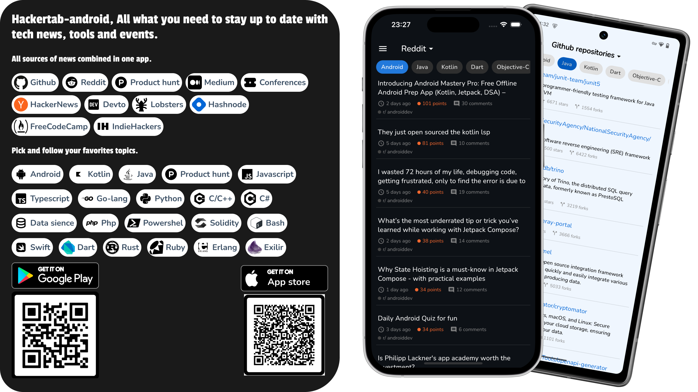

# hackertab-mobile

<table align="center">
<tr>
<td>
 
</td>
</tr>
</table>

## 📝 About

Cross-platform (Android/iOS) application built with Kotlin Multiplatform and Compose Multiplatform.
Hackertab brings the latest news, repositories, libraries, tech events... related to your profile (
mobile, back-end, full stack, data scientist...) and visualize them in a proper way so you don't
have to waste time jumping between different data sources.
It aggregates data from 11 sources, including GitHub, HackerNews, Dev.to, and Medium, with
customizable source preferences. Follow 26+ topics like Android, Kotlin, Java, JavaScript, and
TypeScript all visualized in an intuitive interface.

This is the Mobile(Non official) version of [hackertab.dev](https://hackertab.dev) extension brought to your
phone now so you stay always posted even if you’re not on your pc.

## ⬇️ Download

<div style="display: flex; flex-wrap: wrap; justify-content: center; gap: 20px; align-items: center;">
  <a href="https://play.google.com/store/apps/details?id=com.zrcoding.hackertab" style="display: inline-block;">
    
  </a>
  <a href="https://apps.apple.com/us/app/hackertab-unofficial/id6746347807" style="display: inline-block;">
    
  </a>
</div>

<style>
/* Responsive layout for download buttons */
@media (max-width: 768px) {
  div[style*="display: flex"] {
    flex-direction: column !important;
    gap: 15px !important;
  }
}

@media (min-width: 769px) {
  div[style*="display: flex"] {
    flex-direction: row !important;
    justify-content: center !important;
    gap: 30px !important;
  }
}
</style>

<br>

You can check the [releases](https://github.com/zouhir96/hackertab-android/releases/latest) page for
details.

## 🔨 Stack

- Kotlin 2.3.0, coroutines
- Kotlin Multiplatform & Compose Multiplatform 1.9.3 + Material 3
- Bundled fonts: Geist Sans & Geist Mono (default), plus user-selectable Inter, Nunito and
  JetBrains Mono
- Bottom-navigation-based information architecture (Today · Bookmarks · Settings)
- Clean architecture / MVVM
- Multi-Module architecture
- Dependency injection - Koin
- Version catalog & Convention plugins
- REST API / Ktor client
- Datastore-preferences
- Github actions: Run tests, deploy to google play

## 🛠️ Resources

- Figma: [Design file](https://www.figma.com/file/IMFz1yU7jLCIQL1ZM0X8t7/Hackertab?type=design&node-id=0-1&mode=design&t=7yYklSUnlheLkOaN-0)
- Trello: [Project board](https://trello.com/b/OaxWzI96/hackertab)

### Features

- [x] 12 sources of news: Github, Hackernews, Conferences, Devto, Producthunt, Reddit, Lobsters,
      Hashnode, Freecodecamp, IndieHackers, HackerNoon and Medium.
- [x] 26+ Topics to follow: Android, Kotlin, Java, JavaScript, TypeScript ...
- [x] Profile-aware onboarding (Mobile / Frontend / Backend / Data / Fullstack).
- [x] **Today** feed with a per-source rail and inline topic filtering, pull-to-refresh and
      long-press card actions (Save · Share · Open in browser).
- [x] Searchable Bookmarks with swipe-to-delete, grouping (All / By source / By date) and
      read/unread indicators.
- [x] Appearance customization: Light · Dark · System theme, 6 color palettes and 4 fonts —
      all switch live, no restart.
- [x] Post-onboarding guided tour anchored to the real layout, replayable from Settings → About.
- [x] Configure which sources / topics to follow.
- [x] About screen: send feedback by email, source code, privacy policy, rate us.
- [x] Support large screens (Tablet & iPad) with adaptive NavRail + list-detail.

### What's new in v4

The v4 release is a full visual and structural redesign:

- New Material 3 design system with a shared component library (cards, rails, chips, states)
  in `core/design`.
- Bottom-navigation IA replaces the legacy drawer (Today · Bookmarks · Settings).
- **Today** feed with a per-source rail, inline topic filtering and pull-to-refresh.
- Bookmarks tab gains search, swipe actions, group-by chips, and read/unread badges.
- Appearance screen: Light · Dark · System theme, 6 color palettes (brand default, amber, cyan,
  violet, orange, emerald) and 4 fonts (Geist, Inter, Nunito, JetBrains Mono) — persisted and
  applied live.
- Profile-aware onboarding flow with a guided tour on first feed visit, replayable from
  Settings → About.
- Functional About screen: send feedback, source code, privacy policy, rate us.
- Long-press action sheet on cards: Save · Share · Open in browser.
- WCAG 2.1 AA accessibility pass and adaptive tablet layout.

## 🧩 Requirements

Android Studio 4.2 or newer.

## ⬆️ Contributing

See [the contributing guide](CONTRIBUTING.md) for detailed instructions on how to get started with
our project.

## 🔗 Authors

[@Zouhir](https://rajdaoui-zouhir.vercel.app)
[@Amine](https://twitter.com/aminekarimii)

## License 🔖

```
    Apache 2.0 License


    Copyright 2022 RAJDAOUI Zouhir

    Licensed under the Apache License, Version 2.0 (the "License");
    you may not use this file except in compliance with the License.
    You may obtain a copy of the License at

       http://www.apache.org/licenses/LICENSE-2.0

    Unless required by applicable law or agreed to in writing, software
    distributed under the License is distributed on an "AS IS" BASIS,
    WITHOUT WARRANTIES OR CONDITIONS OF ANY KIND, either express or implied.
    See the License for the specific language governing permissions and
    limitations under the License.

```
